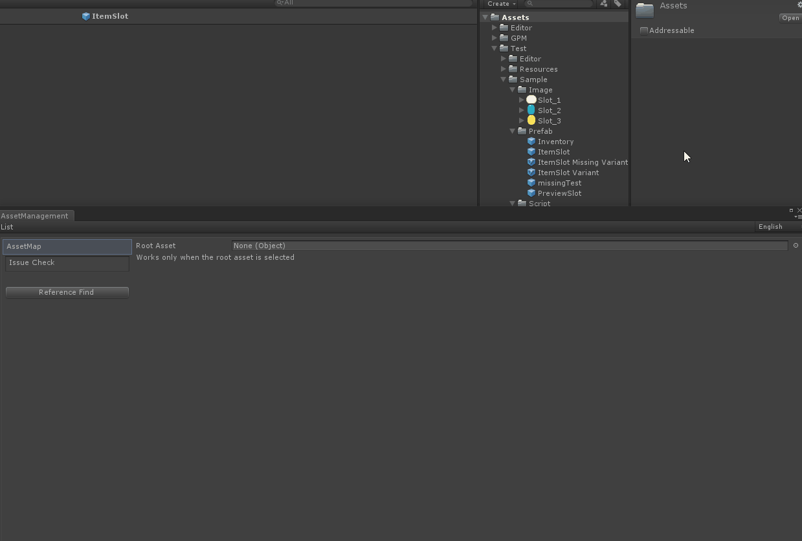
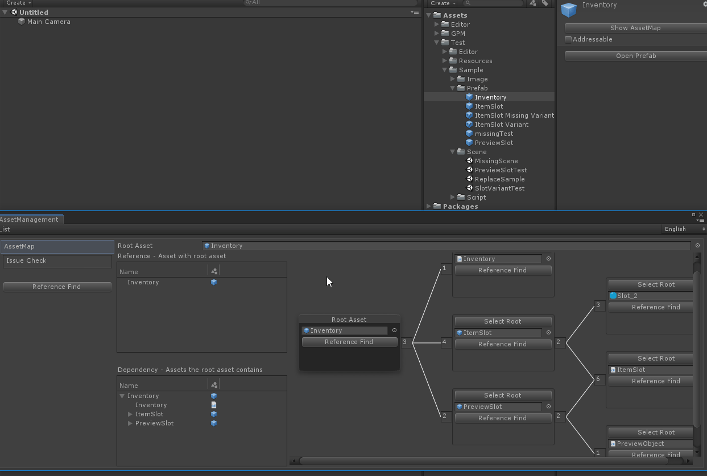
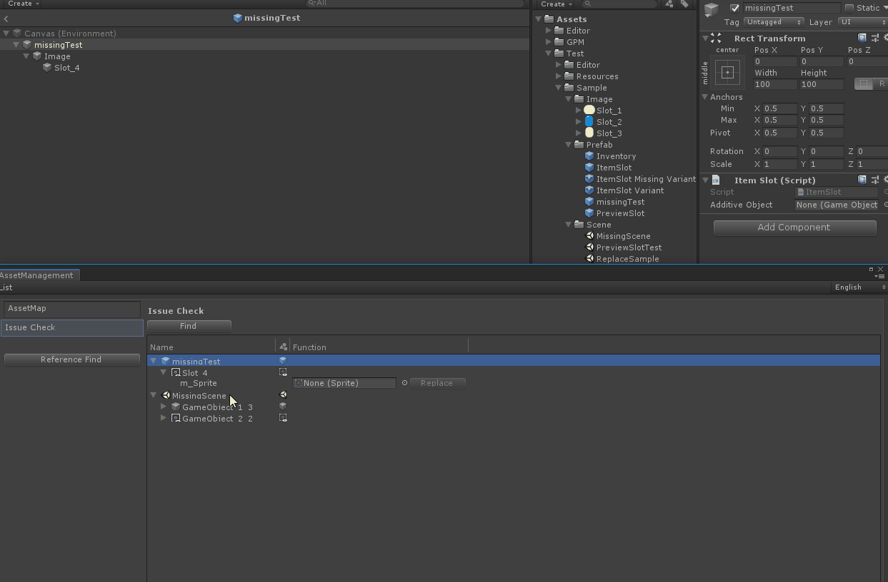
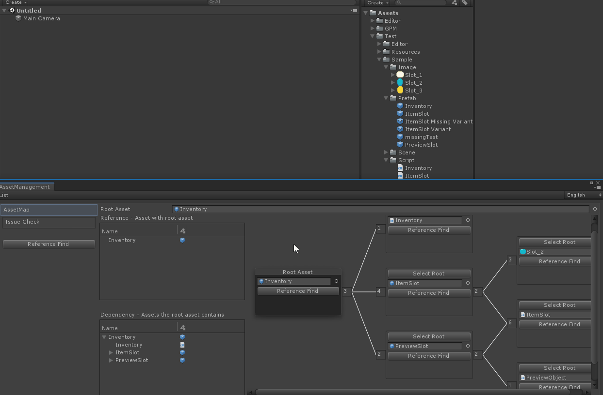
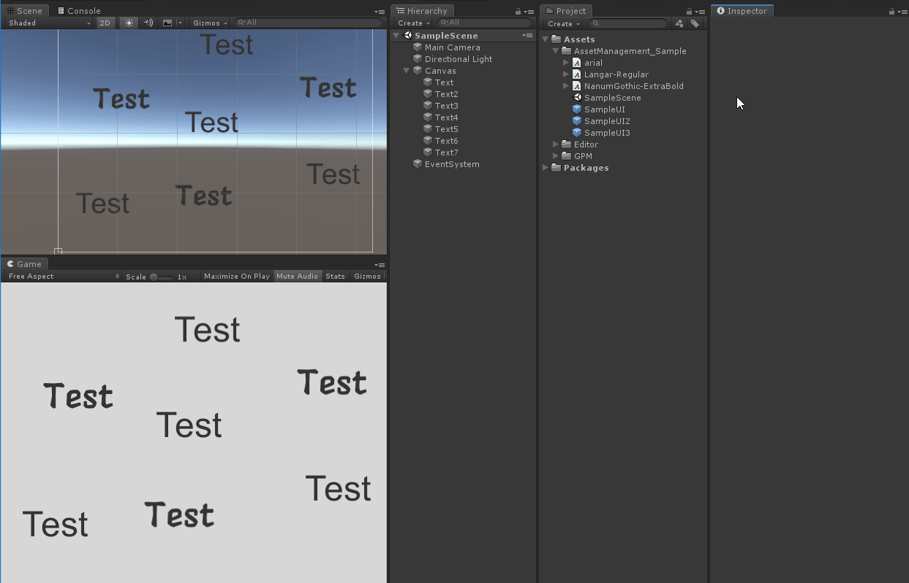
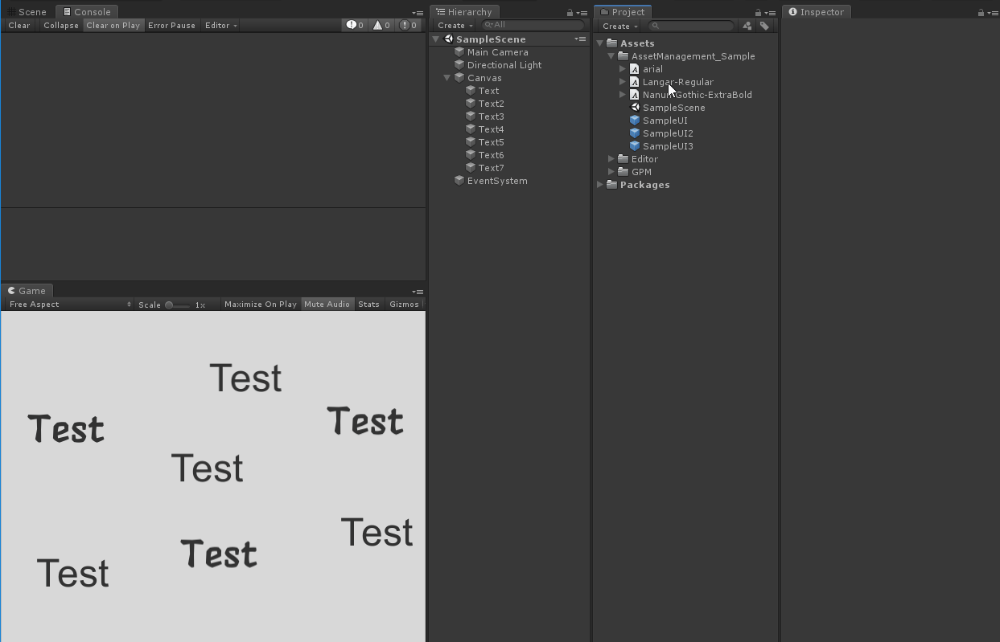
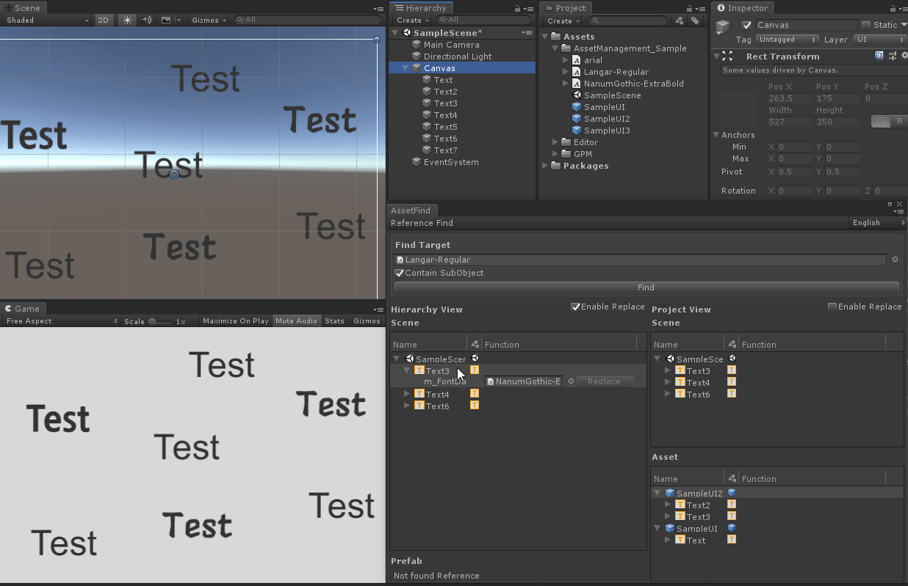
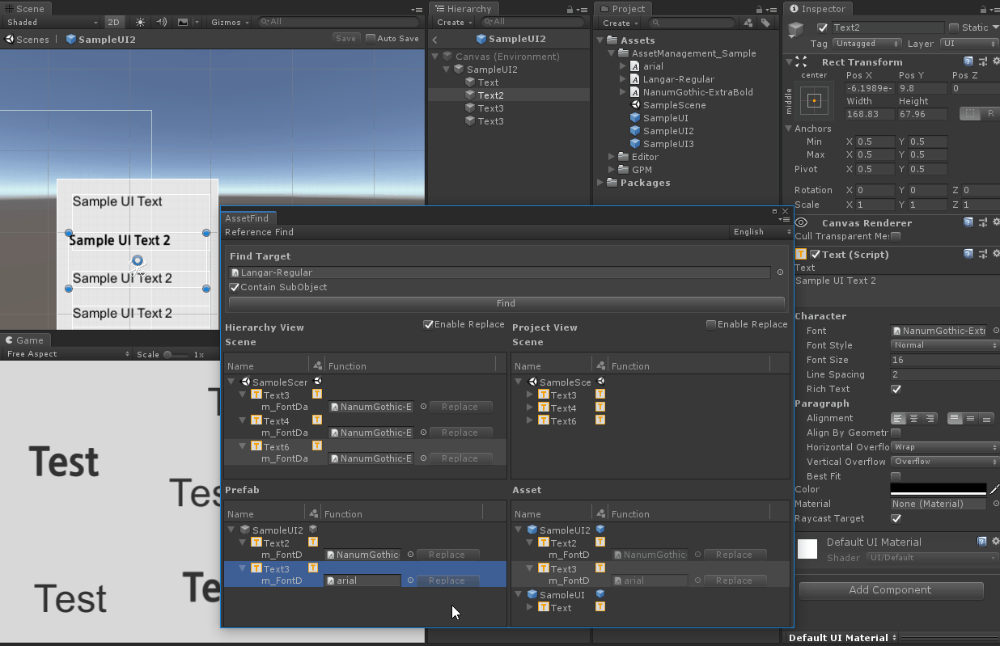

# Aassetmanagement

🌏 [한국어](README.md)

## 🚩 Table of Contents

* [Overview](#Overview)
* [Specification](#Specification)
* [Features](#Features)
    * [AssetMap](#AssetMap)
    * [Finding asset issues](#Finding-asset-issues)
    * [Finding asset reference](#Finding-asset-reference)
* [How to Use](#How-to-Use)
    * [Activate](#Activate)
    * [Seeing asset structure](#Seeing-asset-structure)
    * [Using asset structure](#Using-asset-structure)
    * [Finding and fixing an asset with an issue](#Finding-and-fixing-an-asset-with-an-issue)
    * [Finding-and-replacing-connected-assets](#Finding-and-replacing-connected-assets)
* [Practice with the sample](#Practice-with-the-sample)
    

## Overview
* AssetManagement is a tool used to manage Unity assets with ease.

### What does it do?
1. Can easily understand the relations between assets.
    * Even new assets can be easily analyzed.
2. Can easily learn where each asset is used.
    * Assets can be easily and safely modified and replaced.
3. Can reduce errors by identifying problems in assets.
    * Can easily track down where something is missing and resolve the issue.
    * Warns users with a log when a task has a problem.
4. Can manage and optimize projects.
    * Can easily and safely remove useless assets to reduce the size of a project.
    * Can minimize the complexity of assets to reduce the size of the build.

## Specification

### Unity support version

* Unity 2018.4.0 or higher

## Features

### AssetMap

* Can manage the relation and status of assets at a glance.

1. Root asset setup
    * This is a target that shows the relation and status between assets.
2. Reference tree view
    * Can see the parent asset that uses the target asset.
    * When selected, the graph nodes of the asset are selected.
3. Dependency tree view
    * Can see the child asset that is used by the target asset.
    * When selected, the graph nodes of the asset are selected.
4. Asset graph
	* Shows the graph node that shows the relation between assets.
	* Can easily see the status of assets and mange them.
5. Language setting
    * Can change the language.

### Finding asset issues

* Can identify all assets that have an issue. By issue, it means a status such as "missing".

1. Search the entire issue list
    * Can update the list of assets with an issue whenever users want.
    * It automatically searches when entering for the first time.
2. Asset issue tree view
    * Can see the location and status of the asset with an issue.
    * The asset with something missing can be replaced with another asset to instantly solve the problem.
3. Language setting
    * Can change the language.

### Finding asset reference
* Can easily find the location where the asset is used and modify it.

1. Search target and option settings
    * Sets the search target and provides search options.
2. Hierarchy view
    * Finds the open scenes and prefabs from the hierarchy.
3. Change hierarchy option
    * Can switch the scenes and prefabs in the hierarchy when activated.
4. Project view
   * Finds the scenes and assets from a project.
5. Switch project option
    * can switch the scenes and assets of a project when activated.
6. Language setting
    * Can change the language.

## How to Use

### Activate

* AssetManagement continuously manages the dependency of an asset and tracks any issues.
It needs to be activated separately to use the feature as it takes some time to cache data for the first time.

* Can open the **AssetManagement** window by clicking the Show AssetMap button in the inspector when the assets of a project is selected.
The **Enable** button is shown if AssetManagement is not activated in the **AssetManagement** window.

* It can be activated or deactivated using the Tools/GPM/AssetManagement/Enable menu.

### Seeing asset structure

* An asset must be set as a root asset in AssetMap to see its relations with others.
There are two ways to set an asset as a root asset.
    1. Directly dragging an asset to root asset
	
    2. Click the **Show AssetMap** button of the asset selected from a project
	

* Reference, dependency, tree view, and asset relationship diagram can be seen based on the root asset as the target.
    * Reference is a parent asset that uses an asset like a material between material and texture.
    * Dependency is a child asset that is used with a texture between material and texture."

### Using asset structure
* Asset relation diagram can be dragged or zoomed in/out using the mouse wheel.
* The graph node is selected when the asset in the tree view is selected.
* Root asset can be changed by clicking the **Select Root** button in each relation diagram. Each root asset has a different relation.

* If the selected asset has an issue, 'There is an issue' button appears. Click the button to see what kind of issue the asset has.
* Click the **Search Reference** button to learn where the asset is being used."

### Finding and fixing an asset with an issue

Any assets with an issue can be identified from a project.
* The top node of the tree is the asset with an issue, and the sub node is the location where the issue has happened.
* The problem location can be selected by double-clicking the sub node.
* The scene asset is added as the additive type and can be checked.

Issues can be edited by selecting the asset with an issue or it can be solved directly in the tool.
* If a reference is missing, put the asset to be replaced in the space of the **Function** tab and click the **Switch** button.
* If a component is missing, only a warning pops up. In this case, select and fix it.
* Even if an issue is solved, it remains in the list until users search issues again. Users can check if the issue is really fixed."

### Finding and replacing connected assets

#### You can see exactly where an asset is being used.

Open the Find Asset tool as below:
* The **Reference Find** button of the asset management tool
* The **Reference Find** button of the graph node in the asset map
* The **GPM Find Reference** menu of the project asset
* The **GPM Find Reference** menu of the context

Specifies the target asset.

The data found are categorized as below:
* Supports the hierarchy view and project view separately.
    * Hierarchy view
        * Finds the currently active scenes and prefabs.
    * Project view
        * Finds the scenes and assets stored in the project.
* Shows scenes and normal assets separately.
    * Scenes assets are included and shown as Additive.

	
The content of the list is as follows:

* The top item of the tree is the asset that is referring the target asset and the sub item is the location of the reference.
* Double-click the sub node to see from where it is referenced.
* A referenced asset can be replaced with a different asset. To replace an asset, drag it to Function and click the **Replace** button."

## Practice with the sample
### Replacing an existing asset and safely deleting it
Try replacing the existing font with a new font file in Sample and deleting the existing one.
* [Download Sample] (./sample/assetmanagement_sample.unitypackage)
* Configure the Sample font connection
	* Scene
        * SampleScene
            * Text - arial
            * Text2 - arial
            * Text3 - Langar-Regular
            * Text4 - Langar-Regular
            * Text5 - arial
            * Text6 - Langar-Regular
            * Text7 - arial
    * Prefab
        * SampleUI
            * Text - Langar-Regular
        * SampleUI2
            * Text - arial
            * Text2 - Langar-Regular
            * Text2 - Langar-Regular
            * Text3 - arial
        * SampleUI3
            * Text - arial

* Objectives
    * Replace the Langar-Regular font with the NanumGothic-ExtraBold font
    * Remove the Langar-Regular font"

#### 1. We will check if Langar-Regular is being used using the asset map.
Use AssetMap to find out which asset uses what.
* Select Langar-Regular from the project.
* It can be checked by opening AssetMap using the Show AssetMap button of Inspector.
	
	
#### 2. A problem occurs when Langar-Regular is removed.
If an asset to which other assets are connected is deleted, an issue occurs to those connected assets.
* The asset with an issue will be displayed in AssetMap.
* All assets with an issue can be tracked and resolved using Issue Check.
	
	
#### 3. Let's change the exiting font with something else.
We identified which asset is using Langar-Regular with AssetMap.
However, we don't exactly know where the asset is being used yet.
We can use Find Asset to pinpoint the asset's location.
* Assets can be searched using the Search Reference button of the AssetMap's graph node.
	
	
#### 4. Let's change the font associated with SampleScene.
Find Asset can be found through the GPM Find Reference menu as well.
We can identify where the asset is being used and replace it. Let's change the font associated with Test3.
* Double-click an item in Find Asset to select the one being used.
* Opening the items under Test3 item reveals all connections. 
* Check the Enable Replacement option box and then place it in NanumGothic-ExtraBold to replace it."
	

#### 5. Let's change the remaining fonts as well.
Find Asset is categorized as the hierarchy view and the project view.
Let's change all fonts of the scenes open in the hierarchy.
Then, open and change the SampleUI2 prefab of the project.
* The Hierarchy view shows the scenes and prefabs that are currently open.
* The Project view shows the assets saved in the project.
	
	
#### 6. Let's check them in the project after storing them.
The items edited in the hierarchy are not immediately saved as a file.
You can see that they are not changed if you check the project.
* They will be changed and applied to the project when the file is saved.
	
	
#### 7. Let's replace them manually in the project as well.
You can manually replace the assets in a project.
* When you change assets in your project, they are instantly saved.
	
	
#### 8. Wrapping Up
Search again to see if anything is associated with anything else.
You can see that there is no reference as everything has been changed.
You can also see that all of the fonts are replaced with new ones.
* If every font has been replaced, you are okay to delete the existing fonts without worries since there are no associated assets anymore."
	