# Aassetmanagement

🌏 [English](README.en.md)

## 🚩 목차

* [개요](#개요)
* [스펙](#스펙)
* [기능 설명](#기능-설명)
    * [에셋 맵](#에셋-맵)
    * [에셋 이슈 찾기](#에셋-이슈-찾기)
    * [에셋 레퍼런스 찾기](#에셋-레퍼런스-찾기)
* [사용 방법](#사용-방법)
    * [활성화하기](#활성화하기)
    * [에셋 구조 보기](#에셋-구조-보기)
    * [에셋 구조 사용하기](#에셋-구조-사용하기)
    * [문제 있는 에셋 찾고 수정하기](#문제-있는-에셋-찾고-수정하기)
    * [연결된 에셋 찾고 바꾸기](#연결된-에셋-찾고-바꾸기)
* [따라 하기](#따라-하기)
    

## 개요
* AssetManagerment는 유니티 에셋들을 손쉽게 관리할 수 있는 툴입니다.

### 무엇을 할 수 있는가?

1. 에셋의 관계를 쉽게 이해할 수 있습니다.
    * 처음 보는 에셋이라도 쉽게 분석할 수 있습니다.
 
2. 에셋이 어디서 쓰이고 있는지 쉽게 알 수 있습니다.
    * 쉽고 안전하게 수정 및 교체할 수 있습니다.
 
3. 에셋에 문제가 있는지 파악하여 오류를 줄일 수 있습니다.
    * missing이 발생한 지점을 추적하여 쉽게 수정할 수 있습니다.
    * 작업 중 문제가 발생했다면 경고 로그로 알려줍니다.
 
4. 프로젝트를 관리하며 최적화에 도움을 줍니다.
    * 필요 없는 에셋을 쉽고 안전하게 제거하여 프로젝트 크기를 줄여줍니다.
    * 에셋의 복잡도를 최소화해 빌드 크기를 줄일 수 있습니다.
 

## 스펙

### 서비스 지원 버전

* Unity 2018.4.0 이상

## 기능 설명

### 에셋 맵

* 에셋의 관계와 상태를 한눈에 관리할 수 있게 해줍니다.
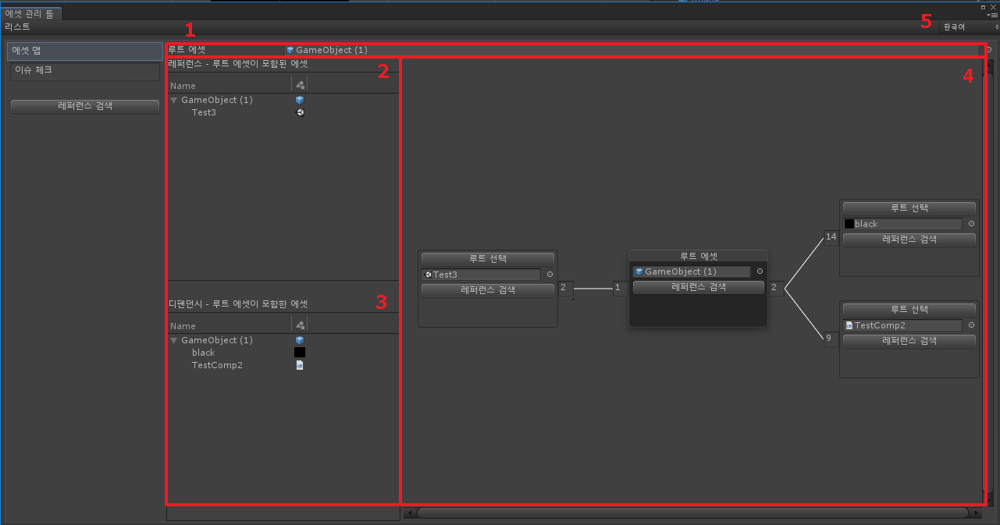

1. 루트 에셋 설정
    * 에셋의 관계와 상태를 보여줄 대상입니다.
2. 레퍼런스 트리 뷰
    * 대상 에셋을 사용하는 부모 에셋을 알 수 있습니다.
    * 선택 시 해당 에셋의 그래프 노드가 선택됩니다.
3. 디팬던시 트리 뷰
    * 대상 에셋이 사용 중인 자식 에셋을 알 수 있습니다.
    * 선택 시 해당 에셋의 그래프 노드가 선택됩니다.
4. 에셋 그래프
    * 에셋의 관계를 보여주는 그래프 노드를 보여줍니다. 
    * 에셋의 상태를 볼 수 있고 관리하기 쉽게 도와줍니다.
5. 언어 설정
    * 언어를 변경할 수 있습니다.

### 에셋 이슈 찾기

* 이슈가 있는 전체 에셋을 알 수 있습니다. 이슈는 missing과 같은 상태입니다.
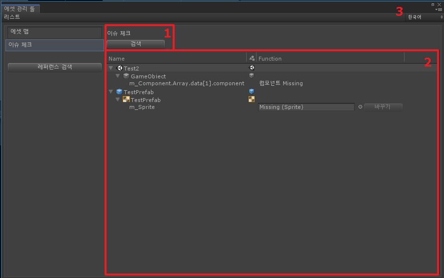

1. 이슈 리스트 전체 검색
    * 원하는 시점에 이슈가 있는 에셋 리스트를 갱신을 할 수 있습니다.
    * 첫 진입 시에는 자동으로 검색해 줍니다.
2. 에셋 이슈 트리 뷰
    * 이슈가 있는 에셋과 해당 위치, 상태를 알 수 있습니다.
    * missing이 발생한 에셋을 바꾸기로 즉시 해결도 가능합니다.
3. 언어 설정
    * 언어를 변경할 수 있습니다.

### 에셋 레퍼런스 찾기
* 에셋이 사용되는 지점을 찾고 쉽게 수정할 수 있게 해줍니다.
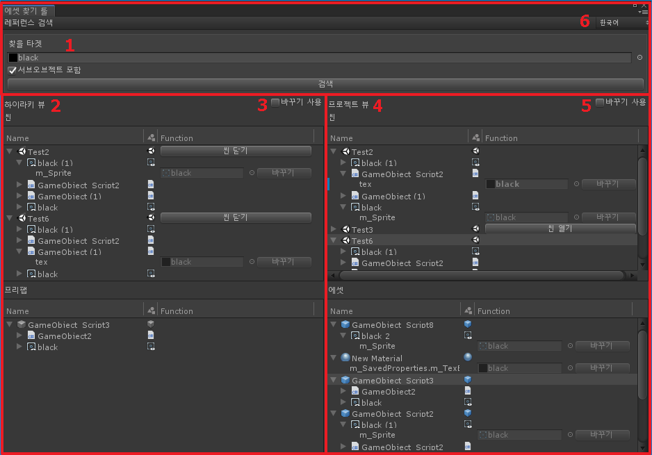

1. 검색 대상 및 옵션 설정 
    * 찾을 대상에 대한 설정과 검색 옵션을 제공합니다.
2. 하이라키 뷰 
    * 하이라키에 있는 열려있는 씬과, 열린 프리팹을 찾아줍니다.
3. 하이라키 바꾸기 옵션 
    * 활성화 시 하이라키에 있는 씬과, 프리팹을 바꿀 수 있습니다.
4. 프로젝트 뷰
    * 프로젝트에 있는 씬과 에셋을 찾아줍니다.
5. 프로젝트 바꾸기 옵션
    * 활성화 시 프로젝트에 있는 씬과 에셋을 바꿀 수 있습니다.
6. 언어 설정
    * 언어를 변경할 수 있습니다.

## 사용 방법

### 활성화하기

* AssetManagement는 지속해서 에셋의 의존성을 관리해 주고 이슈를 추적합니다.
처음 데이터를 캐싱하는 데 시간이 걸리기 때문에 따로 활성화해야 기능을 사용할 수 있습니다.

* 프로젝트의 에셋 선택 시 인스팩터의 Show AssetMap 버튼을 통해 에셋 관리 창을 열 수 있습니다.
에셋 관리 창에서 AssetManagement가 활성화되어있지 않다면 활성화 버튼이 노출됩니다.
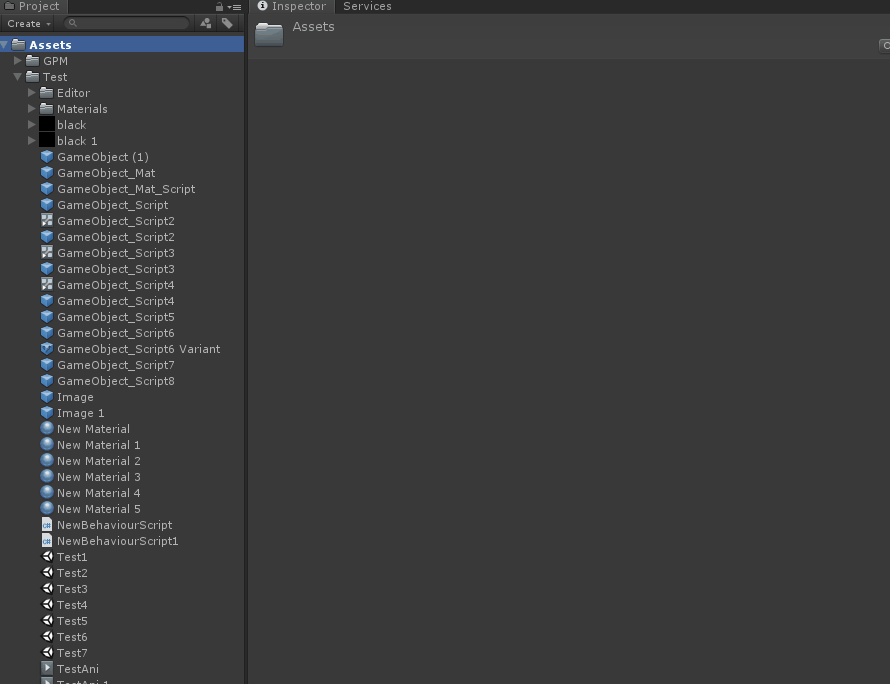

* Tools/GPM/AssetManagement/Enable 메뉴로 활성화/비활성화가 가능합니다.

### 에셋 구조 보기

* 원하는 에셋의 관계 상태를 보기 위해서는 AssetMap에서 루트 에셋으로 지정해야 합니다. 
두 가지 방법이 있습니다.
    1. 루트 에셋에 드래그하여 직접 넣기
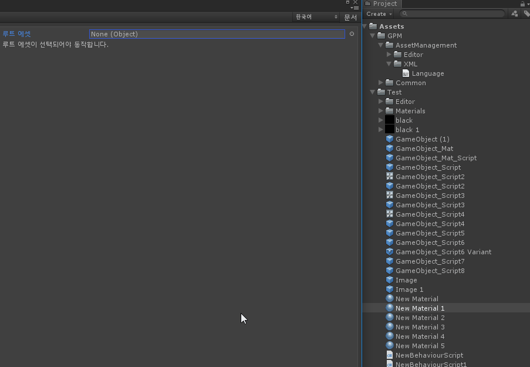
    2. 프로젝트의 선택된 에셋 Show AssetMap 버튼 클릭
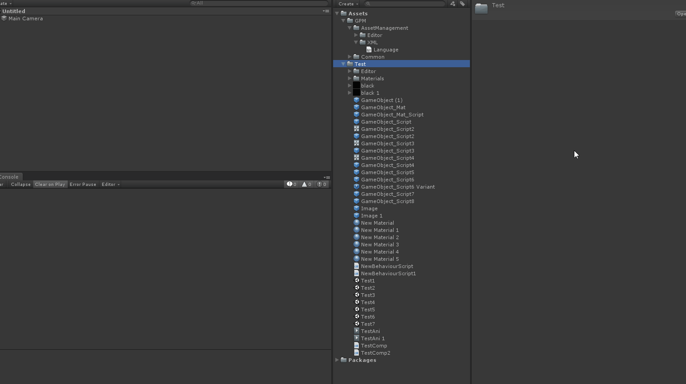

* 루트 에셋을 대상으로 레퍼런스(참조), 디팬던시(의존성) 트리뷰와 에셋의 관계도가 노출됩니다.
    * 레퍼런스(참조)는 머터리얼과 텍스쳐 중 머터리얼같이 에셋을 사용하고 있는 부모 에셋이며
    * 디팬던시(의존성)은 머터리얼과 텍스쳐 중 텍스쳐와 같이 사용되는 자식 에셋입니다.

### 에셋 구조 사용하기
* 에셋 관계도는 마우스 휠 버튼 클릭으로 드래그, 휠 조작으로 줌인-줌아웃을 할 수 있습니다.
* 트리 뷰의 에셋을 선택 시 해당 그래프 노드가 선택됩니다.
* 각 관계도의 루트 선택 버튼을 통해 루트 에셋을 바꿀 수 있습니다. 루트 에셋마다 관계가 다릅니다.

* 해당 에셋이 문제가 되는 이슈가 존재할 경우 '이슈가 있습니다' 버튼이 노출됩니다. 클릭 시 에셋의 이슈를 확인할 수 있습니다.
* 레퍼런스 검색 버튼 클릭 시 해당 에셋이 어느 지점에서 사용되고 있는지 정확히 알 수 있습니다.

### 문제 있는 에셋 찾고 수정하기

프로젝트의 문제가 있는 전체 에셋을 알 수 있습니다.

* 트리의 최상위 노드는 문제가 발생한 에셋이며 하위 노드는 발생 지점입니다.
* 하위 노드 더블클릭 시 해당 문제가 되는 지점으로 선택해 줍니다.
* 씬 에셋의 경우 씬이 addtive 형식으로 추가되며 확인 가능합니다.
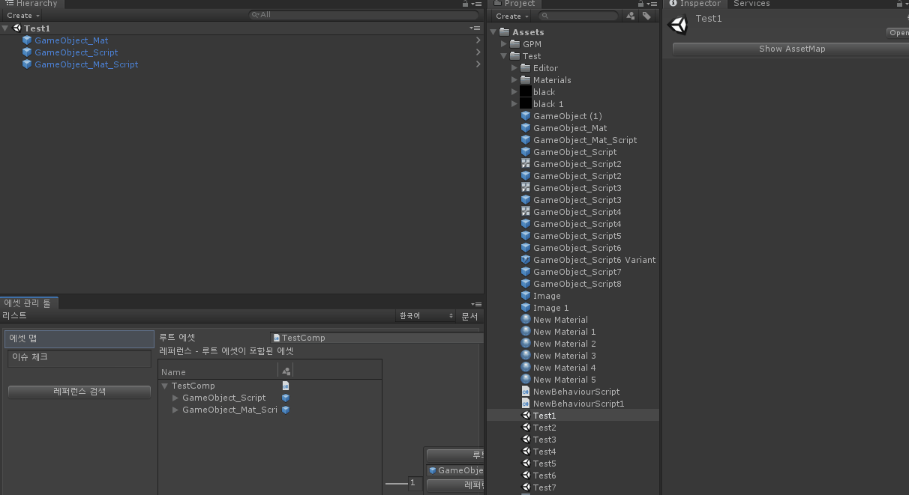

이슈가 발생한 에셋을 선택해서 수정하는 방법 말고도 툴 내에서 즉각적으로 해결할 수도 있습니다.

* 참조가 missing이 발생한 경우 Function 텝에 있는 공간에 바꿔줄 에셋을 넣고 바꾸기를 클릭 시 바뀌고 저장됩니다.
* 컴포넌트 missing일 경우는 경고만 표시됩니다. 이 경우에는 선택하여 수정합니다.
* 문제가 해결돼도 다시 검색할 때까지 리스트에 유지됩니다. 제대로 해결되었나 다시 확인 가능합니다.
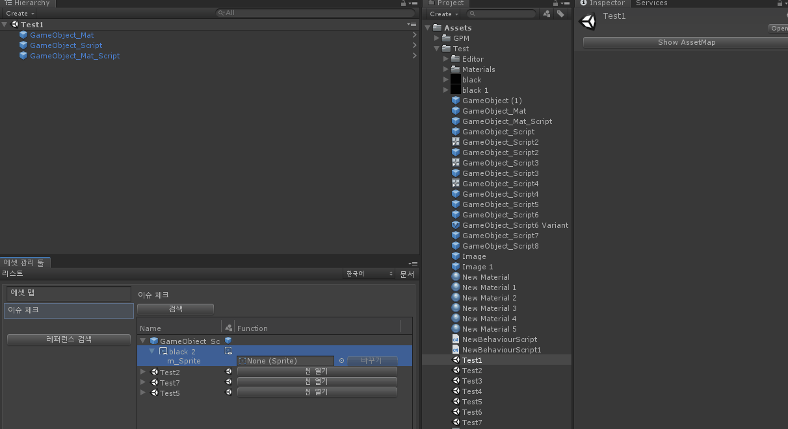

### 연결된 에셋 찾고 바꾸기

#### 해당 에셋이 어느 지점에서 사용되는지 정확히 알 수 있습니다.

에셋 찾기 툴을 여는 방법은 다음과 같습니다.
* 에셋 관리 툴의 레퍼런스 검색
* 에셋 맵의 그래프 노드의 레퍼런스 찾기 버튼
* 프로젝트 에셋의 GPM Findreference 메뉴
* 컨텍스트의 GPM Findreference 메뉴

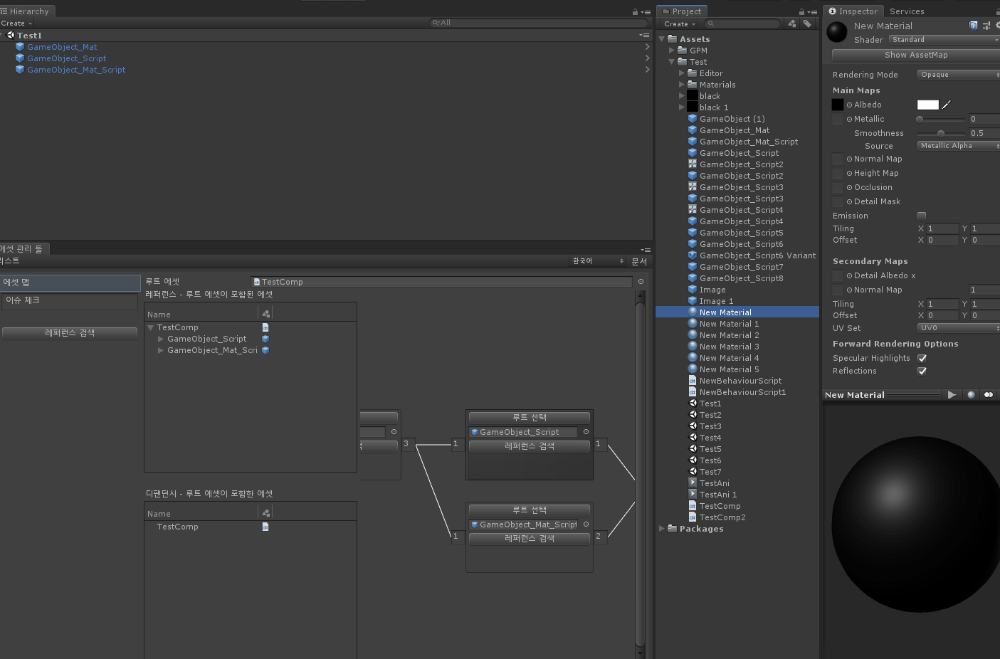
타겟 에셋을 지정하여 찾을 에셋을 설정합니다.

찾은 데이타는 아래와 같이 분류됩니다.

* 하이라키뷰와 프로젝트 뷰를 나눠서 지원합니다.
    * 하이라키뷰
        * 현재 활성화된 씬과 프리팹을 찾아줍니다.
    * 프로젝트뷰
        * 프로젝트에 저장된 씬과 에셋을 찾아줍니다.
* 씬과 일반 에셋을 나눠서 보여줍니다.
    * 씬 에셋은 Additive로 포함하여 보여줍니다.

리스트 내용은 다음과 같습니다.

* 트리의 최상위 아이템은 타겟 에셋을 참조 중인 에셋이며 하위 아이템은 참조지점입니다.
* 하위 노드 더블클릭 시 해당 참조 지점으로 포커스 해줍니다.
* 참조된 에셋을 다른 에셋으로 교체할 수 있습니다. Function에 에셋을 드래그하여 바꾸기 버튼을 누릅니다.

## 따라 하기
### 기존 에셋 교체하고 안전하게 삭제해보기
Sample에서 새로운 폰트 파일로 교체하고 기존 폰트를 삭제해보자 합니다.
* [Sample 다운로드](./sample/assetmanagement_sample.unitypackage)
* Sample 폰트 연결 구성
    * 씬
        * SampleScene
            * Text - arial
            * Text2 - arial
            * Text3 - Langar-Regular
            * Text4 - Langar-Regular
            * Text5 - arial
            * Text6 - Langar-Regular
            * Text7 - arial
    * 프리팹
        * SampleUI
            * Text - Langar-Regular
        * SampleUI2
            * Text - arial
            * Text2 - Langar-Regular
            * Text2 - Langar-Regular
            * Text3 - arial
        * SampleUI3
            * Text - arial

* 목표
    * Langar-Regular 폰트 NanumGothic-ExtraBold폰트로 교체
    * Langar-Regular 폰트 제거.

#### 1. 에셋 맵으로 Langar-Regular가 사용되는지 확인해봅니다.
에셋맵으로 에셋이 어느 에셋에서 사용하는지 관계를 알 수 있습니다.
* 프로젝트에서 Langar-Regular를 선택합니다.
* 인스팩터의 Show AssetMap 버튼을 통해 에셋맵 열어 확인해볼 수 있습니다.
    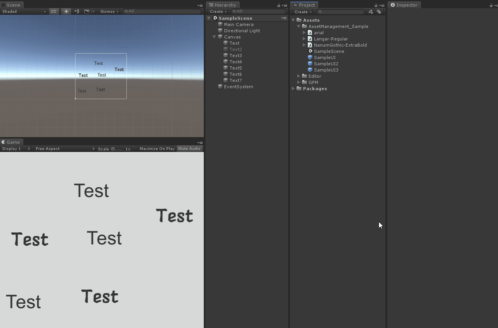

#### 2. Langar-Regular를 제거하면 문제가 발생합니다. 
에셋이 연결되있는데 지우게 되면 연결돼있던 에셋에 문제가 발생합니다.
* 문제가 생긴 에셋은 에셋 맵에서 표시해줍니다.
* 문제 있는 전체 에셋은 이슈 체크를 통해 추적하고 해결할 수 있습니다.
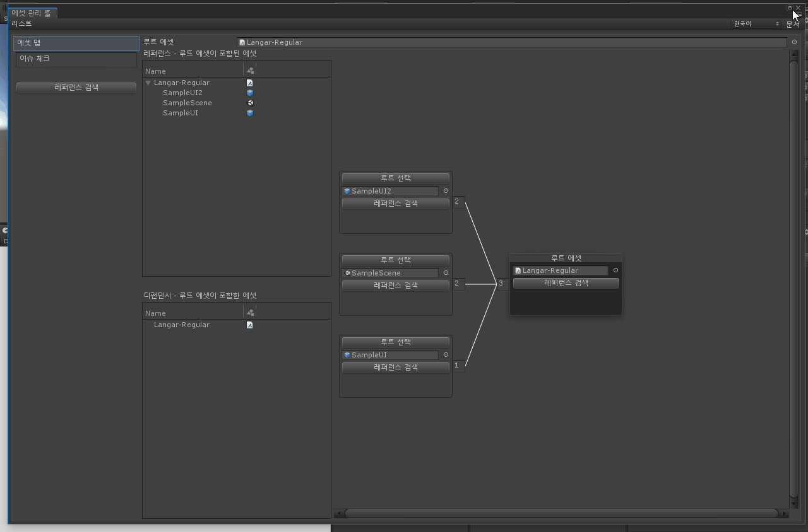

#### 3. 본격적으로 폰트를 다른 폰트로 바꿔봅시다. 
에셋맵으로 Langar-Regular가 어느 에셋에서 사용 중인지는 파악했습니다.
그러나 에셋 어디에서 사용되는지는 아직 정확히 알 수 없습니다. 
에셋 찾기를 통해 어디에서 사용되는지 정확히 알 수 있습니다. 
* 에셋맵 그래프 노드의 레퍼런스 검색 버튼을 통해 에셋 찾기를 할 수 있습니다.
    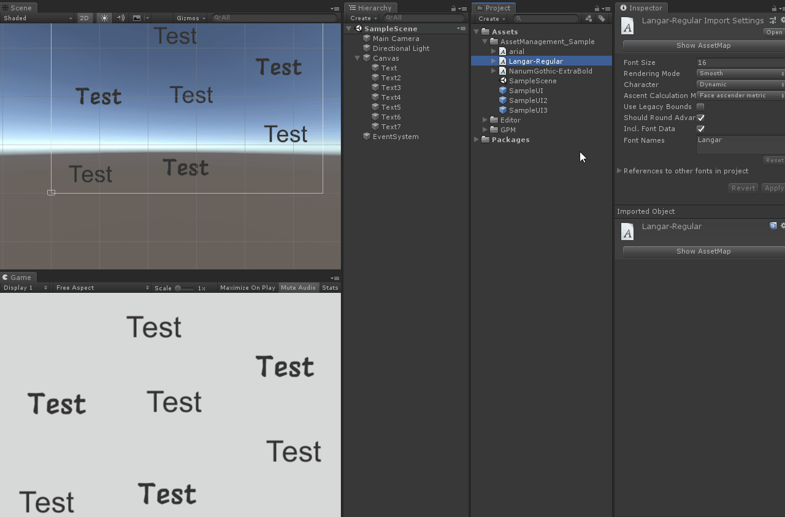

#### 4. SampleScene에 연결된 폰트를 바꿔봅시다.
에셋 찾기는 GPM Find Reference메뉴를 통해도 찾을 수 있습니다.
어디에서 사용되는지 알 수 있으며 교체도 가능합니다. Test3에 연결된 폰트를 바꿔봅니다.
* 에셋 찾기의 아이템을 더블클릭하면 사용하는 지점이 선택됩니다.
* Test3 아이템 하위를 열면 연결된 정보가 보입니다. 
* 바꾸기 사용 옵션 체크 후 연결 정보에 NanumGothic-ExtraBold 넣고 바꿀 수 있습니다.
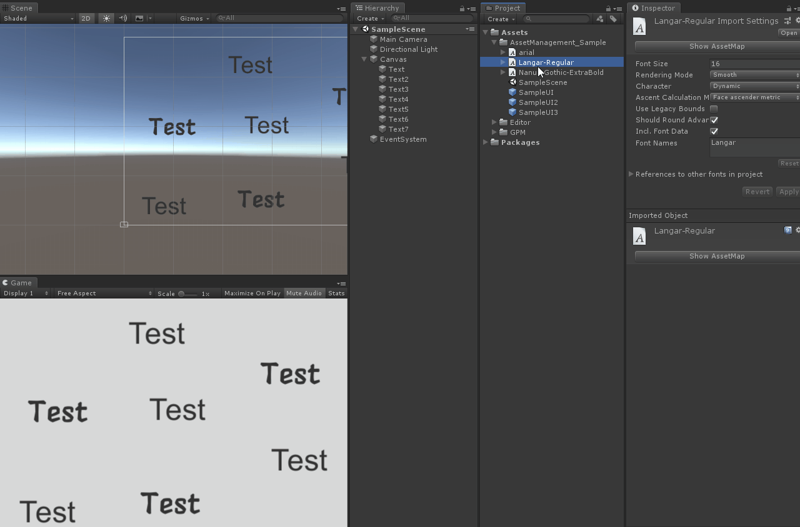

#### 5. 나머지 폰트도 직접 바꿔봅시다.
에셋 찾기는 크게 하이라키 뷰와 프로젝트 뷰로 분류됩니다.
하이라키에 열려있는 씬의 폰트를 전부 바꿔줍시다.
그리고 프로젝트의 SampleUI2 프리팹을 열어서 바꿔봅시다.
* 하이라키 뷰는 현재 열려있는 씬과 프리팹을 보여줍니다.
* 프로젝트 뷰는 프로젝트에 저장돼있는 에셋들을 보여줍니다.
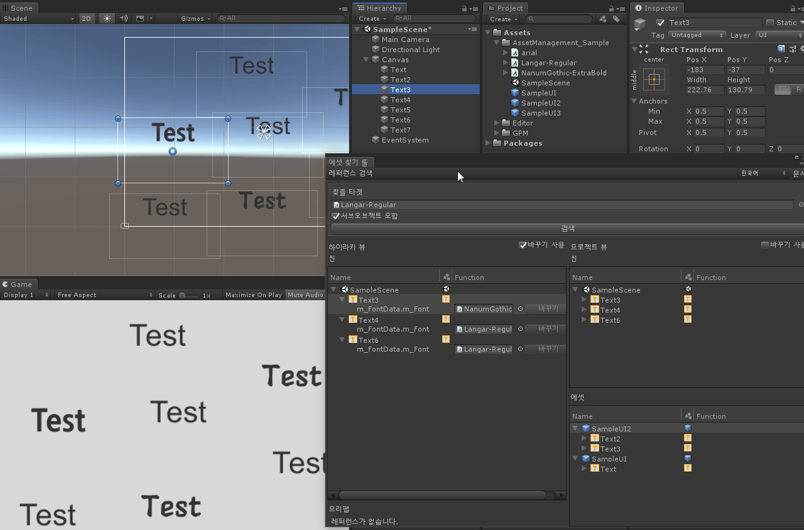

#### 6. 저장 후 프로젝트에서도 확인해봅시다.
하이라키에서 수정한 것은 즉시 파일로 저장되지 않습니다. 
프로젝트를 확인해보았을 때 바뀌지 않은 것을 확인할 수 있습니다. 
* 저장 시 파일이 변경되어 프로젝트에도 적용됩니다.

#### 7. 프로젝트에서도 직접 교체해봅시다.
프로젝트에 있는 에셋을 직접 교체할 수도 있습니다.
* 프로젝트에서 바꾸기 할 때는 즉시 저장됩니다.
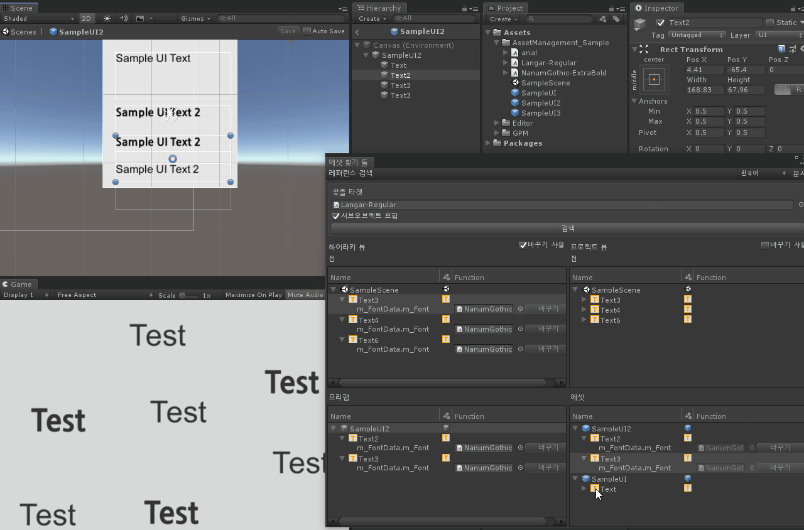

#### 8. 마무리
다시 검색하여 연결된 것이 있는지 확인해봅니다.
전부 교체했기 때문에 레퍼런스가 없는 것을 확인했습니다.
새로운 폰트를 확인해봤을 떄 전부 교체된 것을 확인할 수 있습니다.
* 전부 교체했다면 기존 폰트에는 연결된 에셋이 없어서 삭제해도 무방합니다.
